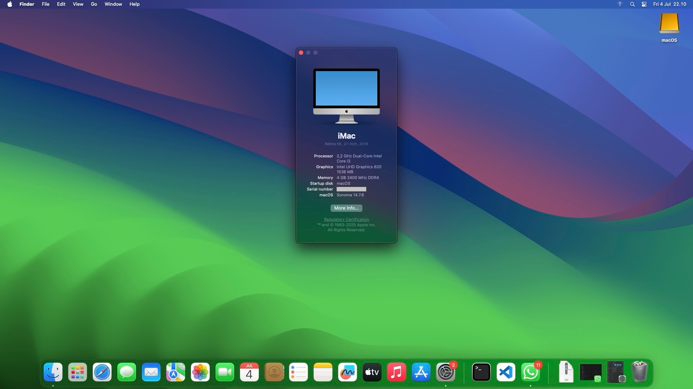

# Acer Aspire C22 865 (All In One PC)

Product Detail: https://www.acer.com/us-en/support/product-support/Aspire_C22-865

## Hardware Specs
-  Processor: Intel® i3-8130U | 2.2 GHz **(Kaby Lake Refresh)**
-  iGPU: Intel® UHD Graphics 620

## What's working?
-   WiFi (Require: [HeliPort](https://github.com/OpenIntelWireless/HeliPort))
-   Audio (Input/Output)
-   HDMI output
-   Webcam

## Requirements
- GenSMBIOS ([Here](https://github.com/corpnewt/GenSMBIOS)) (Required for macOS Serial Number)
